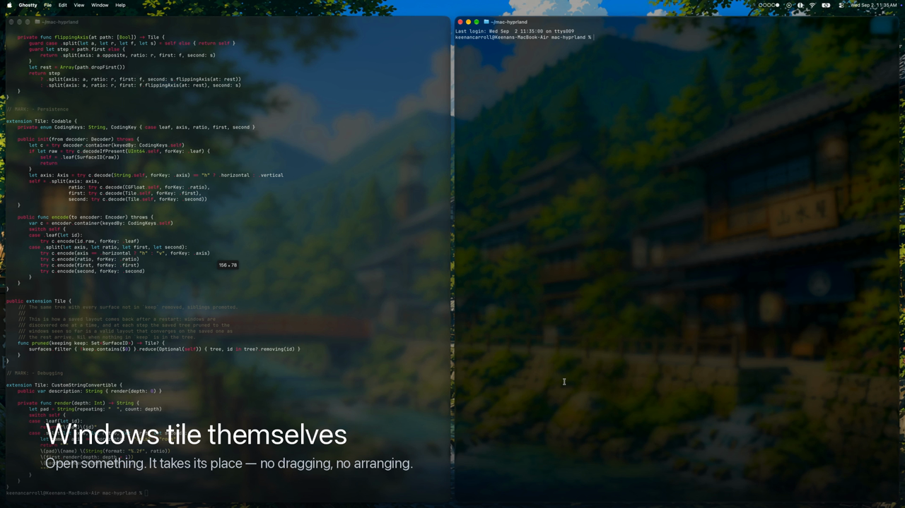

# hyprmac

**Windows that place themselves.** A tiling window manager for macOS in the shape of
[Hyprland](https://hyprland.org) — dwindle layout, gaps, a real config file — that works
with a mouse from the first minute. Native Swift, no dependencies, System Integrity
Protection stays on.

[](docs/hyprmac.mp4)

*(45 seconds — [download the clip](docs/hyprmac.mp4) if it does not play inline.)*

---

## Install

Download the latest `.dmg` from [Releases](../../releases), drag hyprmac into
Applications, open it, and allow Accessibility when it asks.

**macOS 14+ · Apple Silicon · 1 MB · free.** Signed and notarized by Apple, so it opens
with a plain double-click. It needs no Homebrew packages, no build step and no
downloads on first run: the app writes its own config and needs no part of this
repository at runtime.

## What it does

Open a window and hyprmac gives it its share of the screen — sized, positioned, never
on top of anything else. You never nudge one into place or drag a corner to resize it
again.

- **Drag one window onto another and they swap.** Drop it on the left or right half
  instead and that window splits, with yours taking the side you dropped it on. The
  tile lights up before you let go, so you always see what is about to happen.
- **Five workspaces, in your menu bar** — because there is already a bar up there. No
  neon status bar, no fixed dark palette. Your wallpaper, your accent colour, your
  appearance setting.
- **Three fingers up** shows every workspace and every window in it as its app's icon.
  Click one to go to it.
- **Nothing to memorise.** `⌥/` lists every shortcut currently bound, built from your
  live config rather than a manual that drifts out of date.
- **Any window can opt out.** `⌥V` floats one free of the tiling; hyprmac remembers,
  so the app that fights you only fights you once. Apps that refuse to shrink below a
  minimum size are detected and floated rather than left overlapping their neighbours.

## The keys worth knowing

| | |
|---|---|
| `⌥Return` | a terminal |
| `⌥1`…`⌥5` | workspaces |
| `⌥H J K L` | move the focus |
| `⌥⇧H J K L` | move the window |
| `⌥\`` | overview of every workspace |
| `⌥V` `⌥F` `⌥Q` | float · fullscreen · close |
| `⌥/` | every binding, from your live config |

Configuration lives in `~/.config/wisp/hyprmac.conf`, written on first launch, in a
`hyprland.conf` dialect. `⌥⇧C` reloads it.

## Honest limits

- **Apple Silicon, macOS 14+**, one display for now.
- **Mission Control does not see hyprmac's workspaces.** They are not macOS Spaces —
  that is what lets hyprmac work with SIP on — so the two are separate ideas. hyprmac's
  own overview is the one that can find a window in another workspace.
- **macOS's own three-finger swipe** changes desktop and competes with hyprmac's. The
  first-run screen offers to take the gesture; macOS reads that setting at login, so
  it takes effect after a logout, or immediately if you close the extra desktops.
- **Rounded corners on real windows and smooth window animation are impossible**
  without private SkyLight APIs. Accessibility exposes position and size, nothing else.

## Building it yourself

```
scripts/bundle.sh          # build and sign hyprmac.app into build/
scripts/make-dmg.sh        # → dist/hyprmac-<version>-<build>.dmg
scripts/make-dmg.sh --check    # is this Mac set up to notarize?
swift test                 # 177 tests
```

Needs the Command Line Tools; Xcode is not required. Signing uses a Developer ID if the
machine has one and falls back to a locally made identity otherwise, because macOS keys
the Accessibility grant to a signature and an unstable one costs you the grant on every
rebuild.

## More

- [wisp-os.com](https://wisp-os.com) — the site, and [Wisper](https://wisp-os.com),
  the local assistant that drives hyprmac when it is installed alongside.
- [NOTES.md](NOTES.md) — the long form: how parking works, what was measured, which
  approaches failed and why. Written as it was built.
- [BUGS.md](BUGS.md) — the open bug log for this beta.
